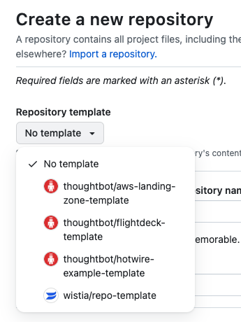

The landing zone repository contains foundational [Cloudformation
templates](https://aws.amazon.com/cloudformation/) and [service control
policies](https://docs.aws.amazon.com/organizations/latest/userguide/orgs_manage_policies_scps.html)
deployed as a customized package for [Customizations for Control
Tower](https://aws.amazon.com/solutions/implementations/customizations-for-aws-control-tower/).
We typically name this repository "*organization*-landing-zone."

<div class="code panel pdl" style="border-width: 1px;">

<div class="codeContent panelContent pdl">

``` syntaxhighlighter-pre
landing-zone/
  manifest.yaml
  policies/
  templates/
```

</div>

</div>

<div class="confluence-information-macro confluence-information-macro-information">

<span class="aui-icon aui-icon-small aui-iconfont-info confluence-information-macro-icon"></span>

<div class="confluence-information-macro-body">

You can create this repository using the
[aws-landing-zone-template](../../reference/templates/landing-zone-template.md),
by selecting it in the Repository template dropdown during repo
creation.

</div>

</div>

GitHub docs for [Creating a repository from a
template](https://docs.github.com/en/repositories/creating-and-managing-repositories/creating-a-repository-from-a-template).


