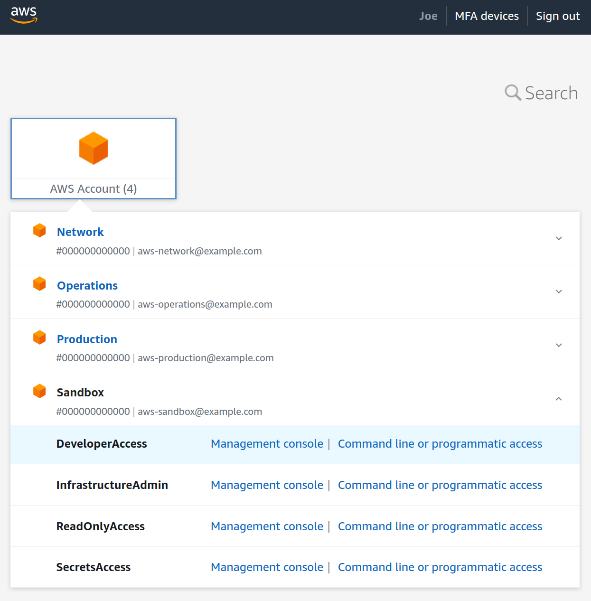
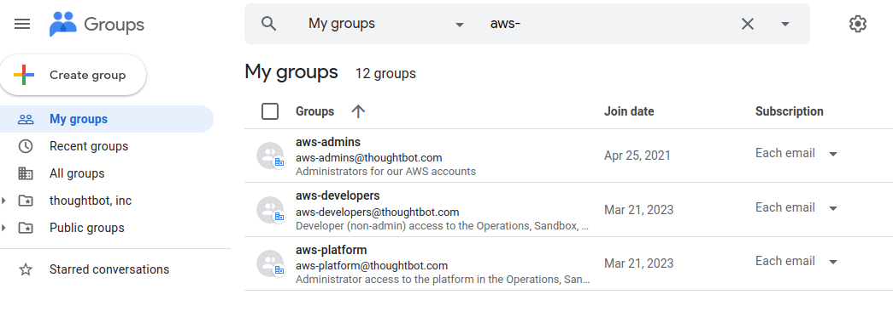

## Access and Permissions

The platform relies on [AWS IAM Identity
Center](https://docs.aws.amazon.com/singlesignon/latest/userguide/what-is.html)
for managing user permissions to resources within AWS accounts. Users
access AWS accounts by using single sign on through the AWS portal for
your organization.

To provide users with AWS permissions:

  - As part of deploying the platform, [single sign on should be
    configured](../landing-zone/configure-single-sign-on.md) for your
    user directory.

  - Create a group in your user directory, such as a Google group or an
    ActiveDirectory security group.

  - Create [permission
    sets](https://docs.aws.amazon.com/singlesignon/latest/userguide/permissionsetsconcept.html)
    in the Identity account to describe what users should be able to do
    in an account.

  - Assign permissions sets to your group for accounts that group should
    be able to access.

Once these steps are complete, users can use single sign on to access
your landing zone and sign into individual AWS accounts using the
permission sets assigned to them.

### Accessing AWS

Your organization will have a landing zone URL configured in IAM
Identity Center, such as <https://example.awsapps.com/start/.>



### Managing Groups

You can synchronize groups in IAM identity center with your user
directory, such as Google or ActiveDirectory. Add users to groups based
on which permissions they should have in AWS.



### Managing Permissions For Groups

We recommend that you manage your permission sets and group assignments
using Terraform. You can use the [terraform-aws-iam-permission-sets
Terraform
module](http://github.com/thoughtbot/terraform-aws-iam-permission-sets)
to provision and assign permission sets in the Identity account.

Create a new module in the infrastructure repository called
`permissions`:

<div class="code panel pdl" style="border-width: 1px;">

<div class="codeContent panelContent pdl">

``` syntaxhighlighter-pre
module "permission_sets" {
  source = "github.com/thoughtbot/terraform-aws-iam-permission-sets?ref=v0.2.0"

  # Define your permission sets. You can attach AWS managed policies or create a
  # custom, inline policy.
  permission_sets = [
    {
      name        = "DeveloperAccess"
      description = "Read and write access to non-administrative resources"

      managed_policies = [
        "arn:aws:iam::aws:policy/PowerUserAccess",
      ]
    },
    {
      name             = "InfrastructureAdmin"
      description      = "Full administrative access for Terraform"
      session_duration = "PT1H"

      managed_policies = [
        "arn:aws:iam::aws:policy/AdministratorAccess",
      ]
    },
    {
      name        = "ReadOnlyAccess"
      description = "Read access to all resources"

      managed_policies = [
        "arn:aws:iam::aws:policy/job-function/ViewOnlyAccess",
      ]
    },
    {
      name             = "SecretsAccess"
      description      = "Ability to read and write application secrets"
      session_duration = "PT1H"

      managed_policies = [
        "arn:aws:iam::aws:policy/SecretsManagerReadWrite",
      ]
    }
  ]

  # For each group, assign permission sets to accounts that group should access.
  group_assignments = {
    aws-admins = {
      Backup     = ["InfrastructureAdmin", "ReadOnlyAccess"]
      Identity   = ["InfrastructureAdmin", "ReadOnlyAccess", "SecretsAccess"]
      Network    = ["InfrastructureAdmin", "ReadOnlyAccess"]
      Operations = ["InfrastructureAdmin", "ReadOnlyAccess", "SecretsAccess"]
      Production = ["InfrastructureAdmin", "ReadOnlyAccess"]
      Sandbox    = ["InfrastructureAdmin", "ReadOnlyAccess", "SecretsAccess"]
    }

    aws-sandbox-developers = {
      Sandbox = ["DeveloperAccess", "ReadOnlyAccess"]
    }

    aws-production-developers = {
      Production = ["DeveloperAccess", "ReadOnlyAccess"]
    }
  }

  default_session_duration = "PT8H"

  # You must map each account name to its account ID, as the Identity account
  # does not have permission to list the accounts in the organization.
  account_ids = {
    Backup     = "000000000000"
    Identity   = "000000000000"
    Network    = "000000000000"
    Operations = "000000000000"
    Production = "000000000000"
    Sandbox    = "000000000000"
  }
}
```

</div>

</div>

After applying the module, permission sets will be provisioned and
assign for each account as configured.
