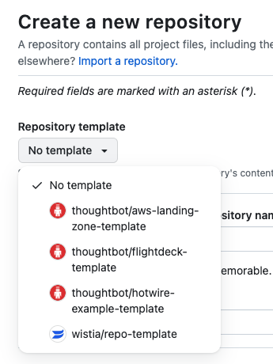

This is an advanced topic for platform engineers.

You can use the [landing zone template
repository](https://github.com/thoughtbot/aws-landing-zone-template) to
set up your landing zone, by selecting the template from the dropdown
during repo creation.

1.  Accept the invitation to join AWS Identity Center that was sent to
    the management account email.

2.  Make a clone of the [landing zone
    template](https://github.com/thoughtbot/aws-landing-zone-template)
    repository.
    
    1.  You can select the template repo from the repo creation page
        
        

3.  If there are legacy accounts to enroll, see [Enroll Existing
    (Legacy)
    Accounts](../landing-zone/launch-customizations-for-control-tower/enroll-existing--legacy--accounts.md).

4.  Run the `bin/deploy` script to launch Customizations for Control
    Tower.

5.  Follow the prompts to configure your landing zone.

You are now ready to [set up your single sign on identity
provider](../landing-zone/configure-single-sign-on.md).
