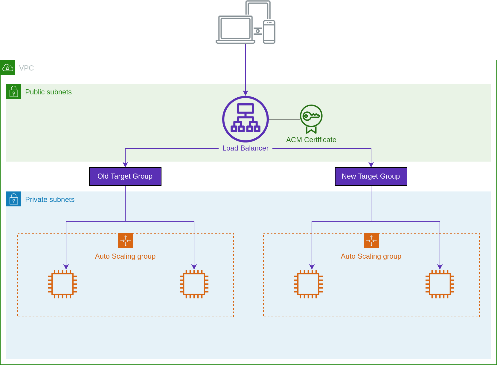

<div class="panel" style="background-color: #FFFAE6;border-width: 1px;">

<div class="panelContent" style="background-color: #FFFAE6;">

This is an advanced topic for platform engineers.

</div>

</div>



Edit the ingress stack for your sandbox clusters.

<div class="code panel pdl" style="border-width: 1px;">

<div class="codeContent panelContent pdl">

``` syntaxhighlighter-pre
infra/
  ingress/
    sandbox/
```

</div>

</div>

Add your new cluster to the list of clusters and target groups.

<div class="code panel pdl" style="border-width: 1px;">

<div class="codeContent panelContent pdl">

``` syntaxhighlighter-pre
module "ingress" {
  cluster_names = ["mycompany-sandbox-v1", "mycompany-sandbox-v2"]

  target_group_weights = {
    mycompany-sandbox-v1 = 100
    mycompany-sandbox-v2 = 0
  }
}
```

</div>

</div>

Apply this module to create the new target group. Using the above
weights, the target group will be created but will receive no traffic.
We will wait until workloads are fully deployed to shift traffic.
